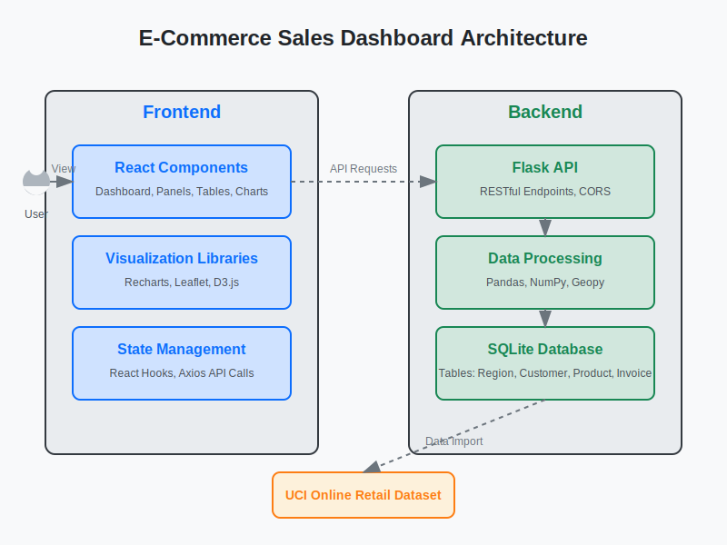

# E-Commerce Sales Dashboard

A comprehensive sales dashboard application built with React and Flask to analyze e-commerce data from the UCI Machine Learning Repository's Online Retail dataset.

## Project Overview

This project provides a full-stack dashboard solution for analyzing e-commerce sales data. It features a React frontend for visualization and a Flask backend with SQL database for data management. Users can view sales metrics, geographic data, and even perform custom SQL queries for deeper analysis.

### Features

- **Interactive Dashboard**: View key metrics like total sales, profits, and profit margins
- **Visual Data Analysis**: Charts showing monthly sales trends
- **Geographic Visualization**: World map displaying sales distribution by country
- **Top Performers**: Tables showing top countries and products by sales and profits
- **SQL Query Tool**: Custom SQL query interface with results visualization

## Architecture
The applicaiton follows a containerized microservies architecture:

- **Fronted Container**: React application serving the UI
    - Cunsumes data from the backend API
    - Visualizes data using Recharts and Leaflet

- **Backend Container**: Flask application with SqLite database
    - Provides RESTfull API endpoints
    - Processes data and handles SQL queries
    - Manages the database layer

## Data Source

This project uses the Online Retail dataset from the UCI Machine Learning Repository:

- **Source**: [UCI Machine Learning Repository](http://archive.ics.uci.edu/dataset/352/online+retail)
- **Description**: This is a transactional data set which contains all the transactions occurring between 01/12/2010 and 09/12/2011 for a UK-based and registered non-store online retail.The company mainly sells unique all-occasion gifts. Many customers of the company are wholesalers.

## API Endpoints

|Endpoint|Method|Description|
|--------|------|-----------|
| `/api/metrics` | GET | Returns overall metrics like total sales and profits|
| `/api/monthly-data` | GET | Returns monthly sales and profit trends|
| `/api/countries-data` | GET | Returns sales and profit data by country|
| `/api/products-data` | GET | Returns sales and profit data by product|
| `/api/map-data` | GET | Returns geojson data with sales data|
| `/api/query-data` | POST | Executes custom SQL queries|

## Database Schema

The application uses a relational database with the following tables:

- **Region**: Geographic information about countries
- **Customer**: Customer information linked to regions
- **Product**: Product details including description and pricing
- **Invoice**: Sales transactions linking products and customers
